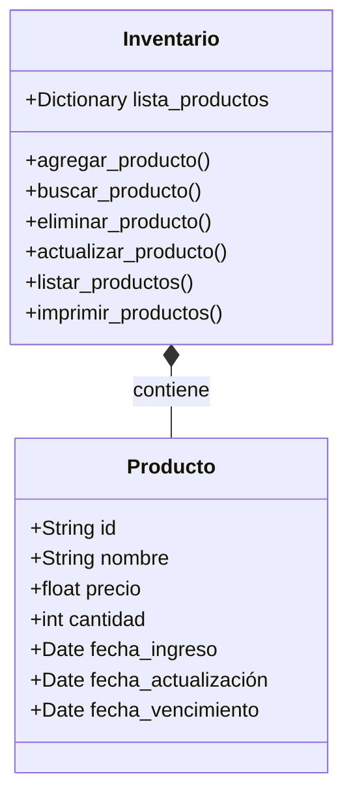

# Proyecto Poo
*Por: Isabella Moreno*

**Problema a solucionar**: Creación de un sistema que administre una bodega a través de un inventario.

## Procesos importantes a tener en cuenta:

- Registro en tiempo real de ingreso y salida de productos
- Registro de los productos al momento de vencerse
- Clasificación por rotación:
   
   - Existen productos que suelen quedarse por más tiempo que otros en la bodega, por eso es importante tener cuenta un estilo de clasificación de los mismos:
     
      - (A): Alta rotación
      - (B): Rotación media
      - (C): Rotación baja

 Una forma de mirar esto, es analizar cuánto tiempo suele quedarse cierto producto en la bodega y asi mismo clasificarlo

- Analizar qué productos tienen mayor salida
- Representación monetaria de lo que se tiene en bodega

- - - - - - - - - - - - - - - - - - - - - - - - - -   - -
Solución preliminar:


- - - - - - - - - - - - - - - - - -
Clases a utilizar:
- Producto
- Inventario

La clase ```producto``` tendrá los siguientes atributos
- Nombre
- Cantidad
- Precio
- Fecha de ingreso
- Fecha de actualización
- Fecha de vencimiento

La clase ```inventario``` tomará los productos que se creen y los meterá a un diccionario. Esto permitirá utilizar los distintos atributos de cada producto y trabajar con ello. Las funciones a implementar serán las siguientes:
- Agregar producto
- Buscar producto
- Eliminar producto
- Actualizar producto
- Listar productos
- Imprimir productos

El objetivo de cada función y su posible implementación se mencionará a continuación:

### Agregar producto

Lo que se busca con esta función es agregar cada producto a un diccionario.

```python
if producto.id in self.lista_productos:
            print("El producto ya existe")
            self.lista_productos[producto.id].cantidad += producto.cantidad
        self.lista_productos[producto.id] = producto
```

### Buscar producto 

Busca un producto según su ID y lo retorna
```python
if id in self.lista_productos:
            return self.lista_productos[id]
        return None
```

### Eliminar producto

Elimina un producto de la lista según su ID
```python
if id in self.lista_productos:
            del self.lista_productos[id]
            return True
        return False
```

### Actualizar producto

Actualiza la información de un producto en el inventario
```python
if producto.id in self.lista_productos:
            self.lista_productos[producto.id] = producto
            return True
        return False
```
### Listar productos
Genera el valor total de productos
```python
def listar_productos(self):
        return self.lista_productos.values()
```

### Imprimir productos
Genera una lista con todos los elementos
```python
def imprimir_productos(self):
        for producto in self.lista_productos.values():
            print(f"ID: {producto.id}\n"
              f"Nombre: {producto.nombre}\n"
              f"Precio: {producto.precio}\n"
              f"Cantidad: {producto.cantidad}\n"
              f"Fecha de Ingreso: {producto.fecha_ingreso}\n"
              f"Fecha de actualización: {producto.fecha_actualización}\n"
              f"Fecha de Vencimiento: {producto.fecha_vencimiento}\n")
```

